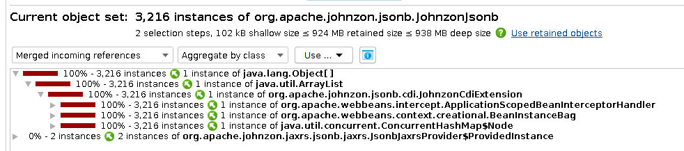

# TomeeJohnzonBugReproducer
Demonstrates a memory leak in TomEE 8.x via Johnzon's CDI integration

Build with Gradle 7.x; on Linux, the following should build and start a TomEE 8.0.14 instance:
```
gradle runTomee
```

To reproduce the issue, call http://127.0.0.1:8080/reproducer/TriggerTest 4-6k times (you can use the included `LeakTest.jmx` JMeter test plan to do this).  The TomEE application server will exhaust its 1GB heap; heap dump analysis will show >900MB retained via the JohnzonCdiExtension.


